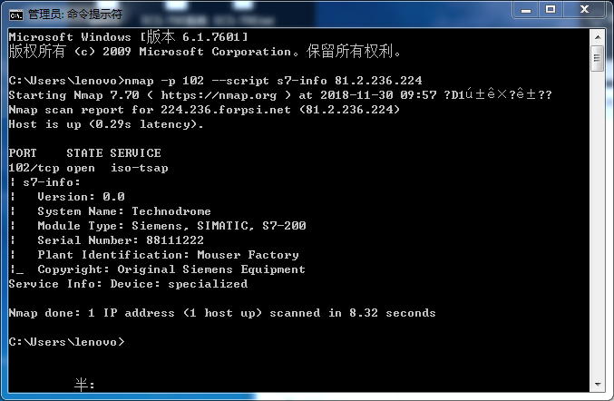
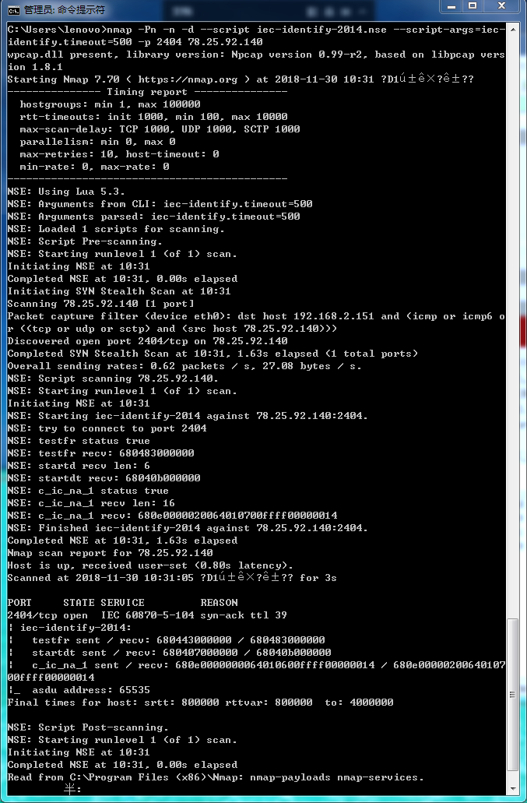
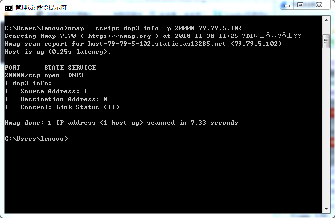
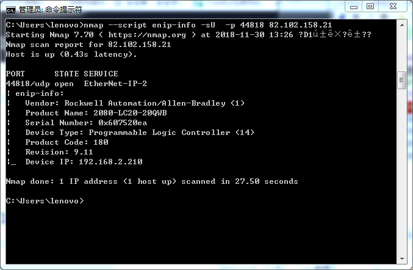
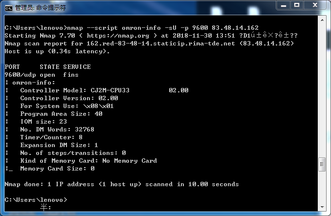
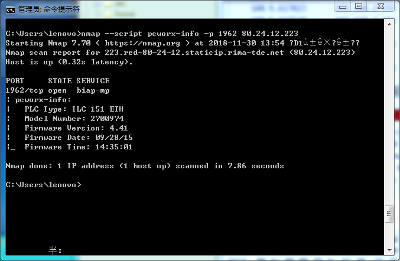
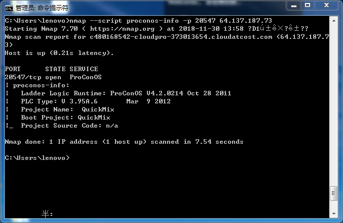
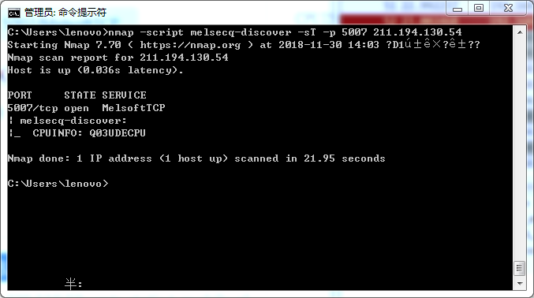

##  工控常见协议

| 协议                | 通信 | 端口  |
| ------------------- | ---- | ----- |
| Siemens S7          | tcp  | 102   |
| Modbus              | tcp  | 502   |
| IEC 60870-5-104     | tcp  | 2404  |
| DNP3                | tcp  | 20000 |
| EtherNet/IP         | udp  | 44818 |
| BACnet              | udp  | 47808 |
| Tridium Niagara Fox | tcp  | 1911  |
| Crimson V3          | tcp  | 789   |
| OMRON FINS          | tcp  | 9600  |
| PCWorx              | tcp  | 1962  |
| ProConOs            | tcp  | 20547 |
| MELSEC-Q            | tcp  | 5007  |

## 工控协议识别

### Siemens S7

```
nmap -sS -Pn -n --min-hostgroup 1024 --min-parallelism 1024 -p 102 --script s7-info -iL 123.txt -oX 123.xml
超速度扫描：
-sS  SYN扫描,又称为半开放扫描，它不打开一个完全的TCP连接，执行得很快，效率高
-Pn  不对目标进行ping探测(不判断主机是否在线)(直接扫描端口)
-n   不反向解析IP地址到域名
–min-hostgroup 1024    最小分组设置为1024个IP地址，当IP太多时，nmap需要分组，然后串行扫描
–min-parallelism 1024  这个参数非常关键，为了充分利用系统和网络资源，我们将探针的数目限定最小为1024
```



### Modbus

```
nmap -sS -Pn -p 502 --script modicon-info -iL 123.txt -oX 123.xml
```


### IEC 60870-5-104

```
nmap -Pn -n -d --script iec-identify.nse  --script-args='iec-identify.timeout=500' -p 2404 <host>
超速度扫描：
nmap -Pn -n --min-hostgroup 1024 --min-parallelism 3000 -d --script iec-identify-2014.nse  --script-args='iec-identify.timeout=500' -p 2404 -iL 2404.txt -oX 2404.xml
```



### DNP3

```
nmap --script dnp3-info -p 20000 <host>
超速度扫描：
nmap -Pn -n --min-hostgroup 1024 --min-parallelism 3000 --script dnp3-info.nse -p 20000 -iL 20000.txt -oX 20000.xml
```



### EtherNet/IP

```
nmap --script enip-info -sU  -p 44818 <host>
超速度扫描：
nmap -Pn -n -sU --min-hostgroup 1024 --min-parallelism 3000 --script enip-info.nse -p 44818 -iL 44818.txt -oX 44818.xml
```



### BACnet

```
nmap --script bacnet-info -sU -p 47808 <host>
超速度扫描：
nmap -Pn -n --min-hostgroup 1024 --min-parallelism 3000 -sU -p 47808 --script bacnet-info.nse -iL 47808.txt -oX 47808.xml
```


### Tridium Niagara Fox

```
nmap --script fox-info.nse -p 1911 <host>
超速度扫描：
nmap -Pn -n --min-hostgroup 1024 --min-parallelism 3000 -p 1911 --script fox-info.nse -iL 1911.txt -oX 1911.xml
```


### Crimson V3

```
nmap --script cr3-fingerprint -p 789 <host>
nmap -Pn -n --min-hostgroup 1024 --min-parallelism 3000 -p 789 --script cr3-fingerprint.nse -iL 789.txt -oX 789.xml
```


### OMRON FINS

```
nmap --script omron-info -sU -p 9600 <host>
nmap --script ormontcp-info -p 9600 <host>
nmap --script ormonudp-info -sU -p 9600 <host>
nmap -Pn -n --min-hostgroup 1024 --min-parallelism 3000 -sU -p 9600 --script ormonudp-info.nse -iL 9600.txt -oX 9600.xml
```



### PCWorx

```
nmap --script pcworx-info -p 1962 <host>
nmap -Pn -n --min-hostgroup 1024 --min-parallelism 3000 -p 1962 --script pcworx-info.nse -iL 1962.txt -oX 1962.xml
```



### ProConOs

```
nmap --script proconos-info -p 20547 <host>
```



### MELSEC-Q

```
nmap -script melsecq-discover -sT -p 5007 <host>
nmap -script melsecq-discover-udp.nse -sU -p 5006 <host>
```

